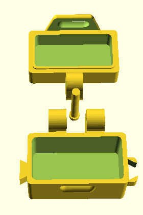
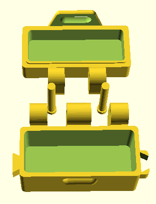
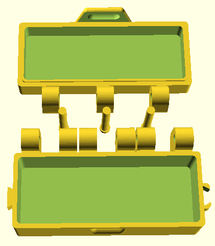
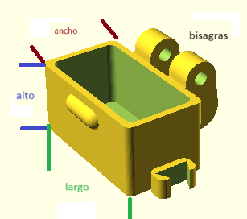
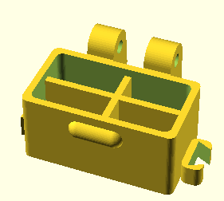

# CustomBox-OpenScad

Generador de caja con tapa y pasadores configurable, Esta librería puede generar una caja que como mínimo pude tener una dimensión de 20 mm de ancho, 30 mm de largo, con una bisagra, esto son los mínimos, pueden incorporar desde 1 a 3 bisagras.

| 1  bisagra | 2 bisagra | 3 bisagra |
| ------ | ------ | ------ |
|  |  |  |


# Configuración

El repositorio "CustomBox-OpenScad" se debe copiar a la carpeta "OpenSCAD\libraries"

# Uso

Se debe incluir al proyecto

```sh
include <CustomBox-OpenScad/CustomBox.scad>
```

Para crear la caja se debe indicar las dimenciones de la caja

```sh
include <CustomBox-OpenScad/CustomBox.scad>

largo=40;
ancho=20;
alto=20;
grosor=2;
partes=2;//1-caja y tapa  - 2 solo caja - 3 solo tapa
bisagras=1;//minimo 1 maximo 3
pasador=false;

makeBox(ancho,largo,alto,grosor,partes,bisagras,pasador);
```

[]

> Valores permitidos
- ancho: Ancho de la caja. Mínimo 20 mm.
- largo: Largo de la caja. Para 2 o 3 bisagras mínimo 80 mm. Para 1 bisagra mínimo 30 mm.
- alto: Alto de la caja, mínimo 10 mm.
- grosor: grosor de la pared.
- modo: Valor para seleccionar las parte. 1 caja y tapa, 2 solo caja, 3 solo tapa (cualquier otro valor no muestra ninguna parte). Por defecto 1.
- bisagras: Cantidad de bisagras 1, 2 o 3 como máximo. Por defecto 1.
- pasadores: Mientras o no pasadores, por defecto los muestra.

Para agregar separaciones se debe implementar el módulo "separador".
Para separador horizontal se debe poner los valores a la función "sepH".
Para separador Vertical se debe poner los valores a la función "sepV".

```sh
module separador(an,la,al,gro){
    sepH(an,la,al,gro,10);
    sepV(an,la,al,gro,20);
}
```

[]